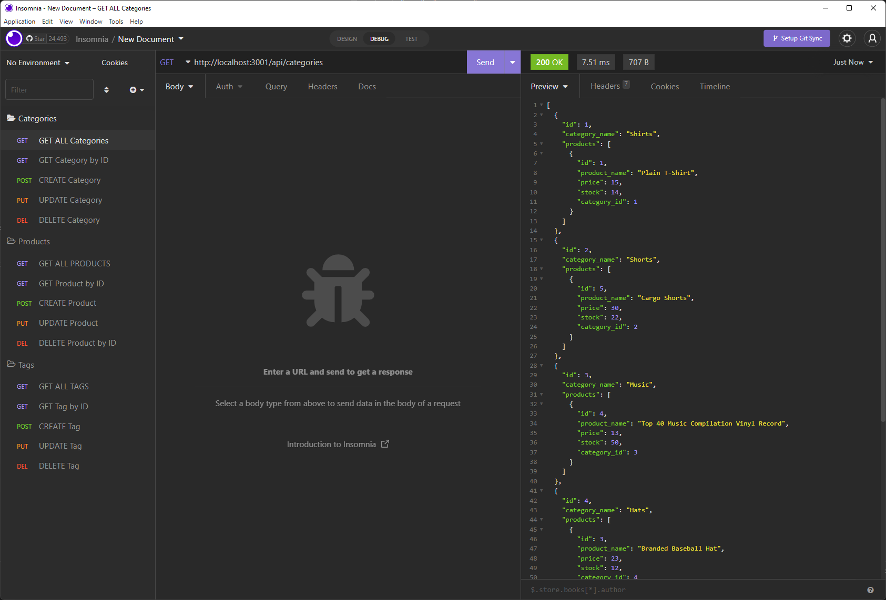
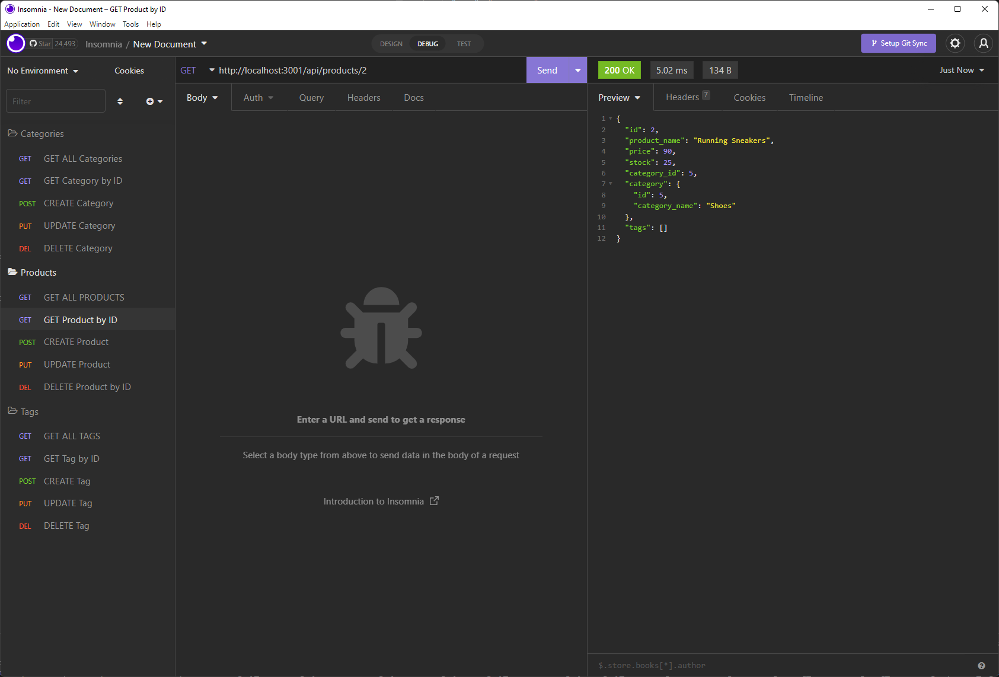

# E-Commerce Back End

## Description

An E-commerce back end architecture. Given a working Express.js API I was tasked with using Sequelize to interact with a MySQL database.

[Click here to view a video walkthrough](https://drive.google.com/file/d/1qNoH3_s93SLIkpHrsoK1vf-KdHDYay1W/view)

## Table of Contents

- [Technologies Used](#technologies)
- [Installation](#installation)
- [Usage](#usage)
- [Credits](#credits)
- [Contributing](#contributing)
- [Questions](#questions)
- [Tests](#tests)

## Technologies

- dotenv npm
- Express.js
- MySQL2 npm
- Sequelize

## Installation

Clone the repository, then run "npm install" to install the dependencies required by the application.

## Usage

After installation change the user_name, password for MySQL and choose a database of your choice in the .env file. To start the application run "npm start" in the command line.

## Contributing

Create a pull request.

## Questions

Please contact me via the following methods.

- Github: [JCaloca](https://github.com/JCaloca)
- Email:

## Tests

No tests were created for this project.
